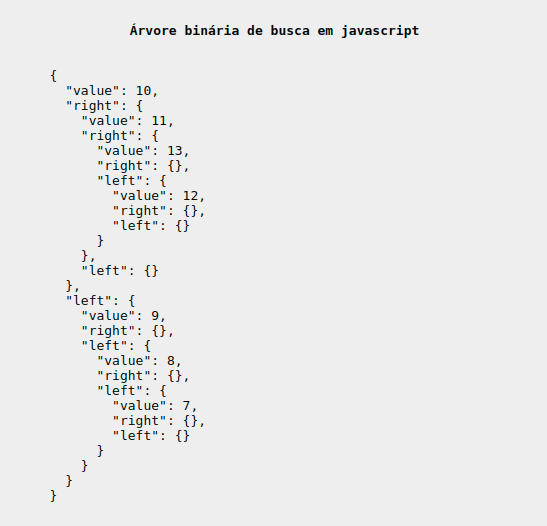
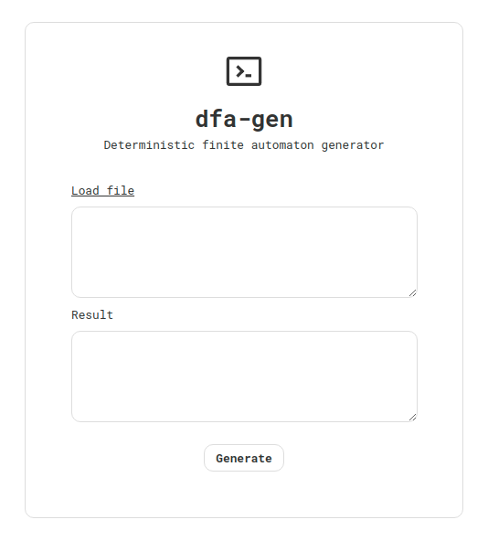

# javascript-studies
A register of my studies and algorithms in javascript.

## color-generator
A color generator in pug, sass and javascript. <a href="https://codepen.io/joziasmartini/pen/NWrGGYz">Online demo</a>.

  

## binary-search-tree
Binary search tree script made with pug, sass and javascript. <a href="https://codepen.io/joziasmartini/pen/eYJeedP">Online demo</a>.

  

## rock-paper-scissors
Classical game made with pug, sass and javascript. <a href="https://codepen.io/joziasmartini/pen/yLavxmy">Online demo</a>.

  

## deterministic-finite-automaton
A automaton that accepts or rejects a given string of symbols.

  

